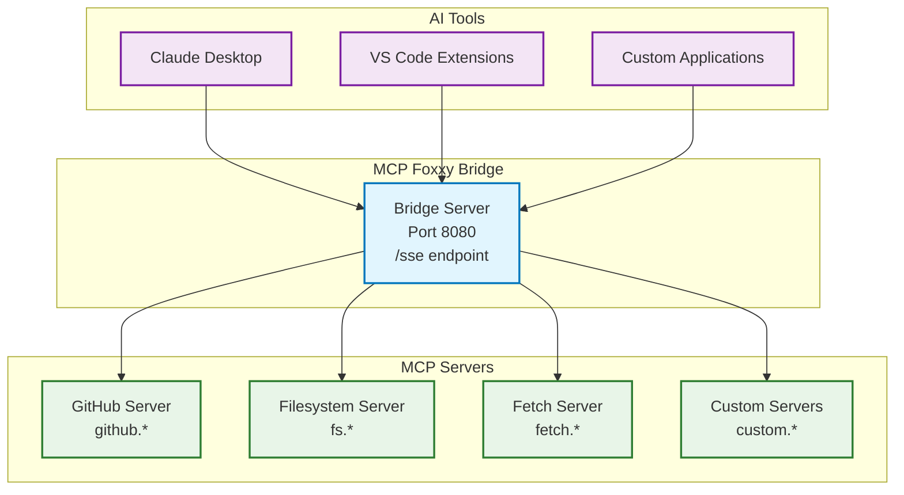

# MCP Foxxy Bridge


[](https://codecov.io/gh/billyjbryant/mcp-foxxy-bridge)

**A forward proxy bridge for the Model Context Protocol (MCP) that aggregates
multiple MCP servers into a single endpoint.**

- [Installation](#installation)
- [Quick Start](#quick-start)
- [Why Use MCP Foxxy Bridge?](#why-use-mcp-foxxy-bridge)
- [Architecture](#architecture)
- [Configuration](#configuration)
- [Usage Examples](#usage-examples)
- [Deployment](#deployment)
- [Documentation](#documentation)
- [Contributing](#contributing)
- [License](#license)

## Installation

### UV (Recommended)

```bash
# Install from PyPI
uv tool install mcp-foxxy-bridge

# Or install latest from GitHub
uv tool install git+https://github.com/billyjbryant/mcp-foxxy-bridge

# Run immediately
mcp-foxxy-bridge --help
```

### Alternative Methods

```bash
# With pipx (from PyPI)
pipx install mcp-foxxy-bridge

# With pip (from PyPI)
pip install mcp-foxxy-bridge

# With Docker
docker run -p 8080:8080 ghcr.io/billyjbryant/mcp-foxxy-bridge:latest --help
```

## Quick Start

1. **Create a configuration file** (`config.json`) or use the included default:

   ```json
   {
     "mcpServers": {
       "filesystem": {
         "command": "npx",
         "args": ["-y", "@modelcontextprotocol/server-filesystem", "./"]
       }
     }
   }
   ```

   Or copy from examples:
   ```bash
   cp docs/examples/basic-config.json config.json
   ```

2. **Start the bridge** (uses `config.json` by default):

   ```bash
   mcp-foxxy-bridge --port 8080
   ```

   Or specify a different config:
   ```bash
   mcp-foxxy-bridge --bridge-config path/to/your/config.json --port 8080
   ```

3. **Connect your AI tools** to `http://localhost:8080/sse`

   Example Claude Desktop configuration:

   ```json
   {
     "mcpServers": {
       "foxxy-bridge": {
         "command": "mcp-foxxy-bridge",
         "args": ["http://localhost:8080/sse"]
       }
     }
   }
   ```

## Why Use MCP Foxxy Bridge?

### The Problem

As an MCP user, you likely use multiple AI tools (Claude Desktop, VS Code,
custom applications), each requiring its own MCP server configuration. This
leads to:

- **Configuration Duplication**: Same MCP servers configured multiple times
- **Management Overhead**: Adding/removing servers requires updating multiple
  configurations
- **Inconsistency**: Different AI tools may have different available tools
- **Complexity**: Each AI tool needs individual MCP server management

### The Solution

MCP Foxxy Bridge acts as a **forward proxy** that:

- **Centralizes Configuration**: Configure all MCP servers in one place
- **Aggregates Tools**: Combine tools from multiple MCP servers into a single
  interface
- **Simplifies Management**: Add/remove MCP servers once, available everywhere
- **Provides Transparency**: AI tools interact with the bridge as if it were a
  single MCP server

### Key Benefits

- **🎯 One-to-Many Architecture**: Single bridge → Multiple MCP servers
- **🔧 Tool Aggregation**: All tools from all servers in one interface
- **🏷️ Namespace Management**: Automatic prefixing prevents tool name conflicts
- **🌍 Environment Variables**: Secure `${VAR_NAME}` expansion in configurations
- **📊 Health Monitoring**: Built-in status endpoint shows server health
- **🐳 Multiple Deployment Options**: Local process, Docker, or UV tool
- **🔄 Graceful Failover**: Individual server failures don't break the bridge

## Architecture



## Configuration

### Basic Configuration

The bridge uses JSON configuration files with two main sections:

```json
{
  "mcpServers": {
    // Individual MCP server configurations
  },
  "bridge": {
    // Bridge-wide settings
  }
}
```

### Server Configuration Options

```json
{
  "mcpServers": {
    "server_name": {
      "enabled": true,                    // Enable/disable server
      "command": "npx",                   // Command to run
      "args": ["-y", "server-package"],   // Command arguments
      "env": {                            // Environment variables
        "API_TOKEN": "${SECRET_TOKEN}"    // Supports ${VAR} expansion
      },
      "timeout": 60,                      // Connection timeout (seconds)
      "retryAttempts": 3,                 // Retry attempts on failure
      "retryDelay": 1000,                 // Delay between retries (ms)
      "toolNamespace": "prefix",          // Tool name prefix
      "priority": 100,                    // Server priority (lower = higher)
      "tags": ["web", "api"],             // Metadata tags
      "healthCheck": {
        "enabled": true,                  // Enable health monitoring
        "interval": 30000,                // Health check interval (ms)
        "timeout": 5000                   // Health check timeout (ms)
      }
    }
  }
}
```

### Bridge Configuration Options

```json
{
  "bridge": {
    "conflictResolution": "namespace",      // How to handle name conflicts
    "defaultNamespace": true,               // Use server name as namespace
    "aggregation": {
      "tools": true,                        // Aggregate tools
      "resources": true,                    // Aggregate resources  
      "prompts": true                       // Aggregate prompts
    },
    "failover": {
      "enabled": true,                      // Enable automatic failover
      "maxFailures": 3,                     // Max failures before marking failed
      "recoveryInterval": 60000             // Recovery attempt interval (ms)
    }
  }
}
```

### Environment Variable Expansion

Securely reference environment variables in configurations:

```json
{
  "env": {
    "GITHUB_TOKEN": "${GITHUB_PERSONAL_ACCESS_TOKEN}",
    "API_URL": "${API_ENDPOINT:https://api.default.com}",
    "DEBUG": "${DEBUG_MODE:false}"
  }
}
```

Syntax:
- `${VAR_NAME}` - Required variable (empty string if not found)
- `${VAR_NAME:default}` - Variable with default value

## Usage Examples

### Command Line Usage

```bash
# Start with configuration file
mcp-foxxy-bridge --bridge-config config.json --port 8080

# Start with inline server definitions
mcp-foxxy-bridge --port 8080 \\
  --named-server fetch 'uvx mcp-server-fetch' \\
  --named-server github 'npx -y @modelcontextprotocol/server-github'

# Enable debug logging
mcp-foxxy-bridge --bridge-config config.json --debug

# Bind to all interfaces (for network access)
mcp-foxxy-bridge --bridge-config config.json --host 0.0.0.0
```

### AI Tool Integration

#### Claude Desktop

Add to `~/.claude/claude_desktop_config.json`:

```json
{
  "mcpServers": {
    "foxxy-bridge": {
      "command": "mcp-foxxy-bridge",
      "args": ["http://localhost:8080/sse"]
    }
  }
}
```

#### VS Code or Custom Applications

Connect MCP clients to the SSE endpoint:

```python
from mcp.client.sse import sse_client
from mcp.client.session import ClientSession

async def connect_to_bridge():
    async with sse_client("http://localhost:8080/sse") as (read, write):
        async with ClientSession(read, write) as session:
            await session.initialize()
            tools = await session.list_tools()
            return tools
```

### Health Monitoring

Check bridge and server status:

```bash
# Get status
curl http://localhost:8080/status

# Pretty print with Python
curl -s http://localhost:8080/status | python -m json.tool

# Monitor continuously
watch -n 5 'curl -s http://localhost:8080/status | jq .'
```

## Deployment

### Local Development

```bash
# Clone and install
git clone https://github.com/billyjbryant/mcp-foxxy-bridge
cd mcp-foxxy-bridge
uv sync

# Run in development mode
uv run mcp-foxxy-bridge --bridge-config bridge_config_example.json
```

### Production with UV

```bash
# Install globally
uv tool install mcp-foxxy-bridge

# Create systemd service (Linux)
sudo tee /etc/systemd/system/mcp-bridge.service > /dev/null << 'EOF'
[Unit]
Description=MCP Foxxy Bridge
After=network.target

[Service]
Type=simple
User=mcp-bridge
Group=mcp-bridge
Environment=GITHUB_TOKEN=your_token
ExecStart=/home/mcp-bridge/.local/bin/mcp-foxxy-bridge \\
  --bridge-config /opt/mcp-bridge/config.json --port 8080
Restart=always

[Install]
WantedBy=multi-user.target
EOF

# Enable and start
sudo systemctl enable mcp-bridge
sudo systemctl start mcp-bridge
```

### Docker Deployment

```bash
# Build image
docker build -t mcp-foxxy-bridge .

# Run container
docker run -d \\
  --name mcp-bridge \\
  -p 8080:8080 \\
  -v ./config.json:/app/config/config.json:ro \\
  -e GITHUB_TOKEN=your_token \\
  mcp-foxxy-bridge --bridge-config /app/config/config.json

# With Docker Compose
docker-compose up -d
```

## Documentation

Comprehensive documentation is available in the `docs/` directory:

- **[Installation Guide](docs/installation.md)** - Detailed installation methods
- **[Configuration Guide](docs/configuration.md)** - Complete configuration
  reference
- **[Deployment Guide](docs/deployment.md)** - Production deployment options
- **[API Reference](docs/api.md)** - HTTP endpoints and client integration
- **[Architecture Overview](docs/architecture.md)** - Technical architecture
  details
- **[Troubleshooting Guide](docs/troubleshooting.md)** - Common issues and
  solutions

## Contributing

We welcome contributions! Please see our [Contributing Guide](CONTRIBUTING.md)
for details on:

- Development setup
- Code style and standards
- Testing requirements
- Pull request process

### Development Setup

```bash
# Clone repository
git clone https://github.com/billyjbryant/mcp-foxxy-bridge
cd mcp-foxxy-bridge

# Install dependencies
uv sync

# Run tests
pytest

# Code formatting and linting
ruff format
ruff check

# Type checking
mypy src/
```

## License

MCP Foxxy Bridge is licensed under the **GNU Affero General Public License
v3.0 or later (AGPL-3.0-or-later)** for open source use.

This means you can use, modify, and distribute the software freely, but any
modifications must be shared under the same license terms.

### Attribution

Portions of this software were originally licensed under the MIT License by
Sergey Parfenyuk (2024) through [MCP Proxy](https://github.com/sparfenyuk/mcp-proxy).
The original MIT license text is included in the LICENSE file for attribution
purposes.

---

**Need help?** Check the [Troubleshooting Guide](docs/troubleshooting.md) or
[open an issue](https://github.com/billyjbryant/mcp-foxxy-bridge/issues) on
GitHub.