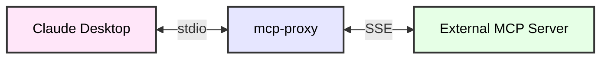
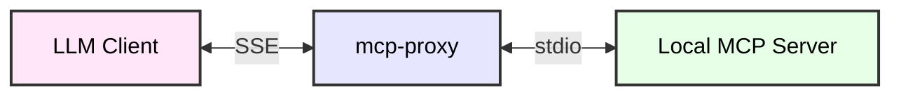

# mcp-proxy

- [mcp-proxy](#mcp-proxy)
  - [About](#about)
  - [1. stdio to SSE](#1-stdio-to-sse)
    - [1.1 Configuration](#11-configuration)
    - [1.2 Example usage](#12-example-usage)
  - [2. SSE to stdio](#2-sse-to-stdio)
    - [2.1 Configuration](#21-configuration)
    - [2.2 Example usage](#22-example-usage)
  - [Installation](#installation)
  - [Testing](#testing)

## About

The `mcp-proxy` is a tool that lets you switch between server transports. There are two supported modes:

1. stdio to SSE
2. SSE to stdio

## 1. stdio to SSE

Run a proxy server from stdio that connects to a remote SSE server.

This mode allows clients like Claude Desktop to communicate to a remote server over SSE even though it is not supported natively.



### 1.1 Configuration

This mode requires the URL of the SSE server to be set. The `API_ACCESS_TOKEN` environment variable can be set to pass the access token to the remote server.

Arguments

| Name           | Required                   | Description                               | Example               |
| -------------- | -------------------------- | ----------------------------------------- | --------------------- |
| command_or_url | Yes, if `SSE_URL` is unset | The MCP server SSE endpoint to connect to | http://example.io/sse |

Environment Variables

| Name               | Required | Description                                                           | Example |
| ------------------ | -------- | --------------------------------------------------------------------- | ------- |
| `API_ACCESS_TOKEN` | No       | Will be sent as a `Bearer` access token in the `Authorization` header | -       |

### 1.2 Example usage

`mcp-proxy` is supposed to be started by the MCP Client, so the configuration must be done accordingly.

For Claude Desktop, the configuration entry can look like this:

```json
{
  "mcpServers": {
    "mcp-proxy": {
        "command": "mcp-proxy",
        "args": ["http://example.io/sse"],
        "env": {
          "API_ACCESS_TOKEN": "access-token"
        }
    }
  }
}
```

## 2. SSE to stdio

Run a proxy server exposing a SSE server that connects to a local stdio server.

This allows remote connections to the local stdio server. The `mcp-proxy` opens a port to listen for SSE requests, spawns a local stdio server that handles MCP requests.



### 2.1 Configuration

This mode requires the `--sse-port` argument to be set. The `--sse-host` argument can be set to specify the host IP address that the SSE server will listen on. Additional environment variables can be passed to the local stdio server using the `--env` argument. The command line arguments for the local stdio server must be passed after the `--` separator.

Arguments

| Name          | Required                   | Description                                                       | Example          |
| ------------- | -------------------------- | ----------------------------------------------------------------- | ---------------- |
| `--sse-port`  | Yes                        | The SSE server port to listen on                                  | 8080             |
| `--sse-host`  | No, `localhost` by default | The host IP address that the SSE server will listen on            | 0.0.0.0          |
| `--env`       | No                         | Additional environment variables to pass to the MCP stdio server  | FOO=BAR          |
| command       | Yes                        | The path for the MCP stdio server command line                    | uvx              |
| arg1 arg2 ... | No                         | Additional arguments to the MCP stdio server command line program | mcp-server-fetch |

### 2.2 Example usage

To start the `mcp-proxy` server that listens on port 8080 and connects to the local MCP server:

```bash
mcp-proxy --sse-port=8080 -- uvx mcp-server-fetch --user-agent=YourUserAgent
```

This will start an MCP server that can be connected to at `http://127.0.0.1:8080/sse`

## Installation

The stable version of the package is available on the PyPI repository. You can install it using the following command:

```bash
# Option 1: With uv (recommended)
uv tool install mcp-proxy

# Option 2: With pipx (alternative)
pipx install mcp-proxy
```

Once installed, you can run the server using the `mcp-proxy` command. See configuration options for each mode above.

The latest version of the package can be installed from the git repository using the following command:

```bash
uv tool install git+https://github.com/sparfenyuk/mcp-proxy
```

> [!NOTE]
> If you have already installed the server, you can update it using `uv tool upgrade --reinstall` command.

> [!NOTE]
> If you want to delete the server, use the `uv tool uninstall mcp-proxy` command.

## Testing

Check the `mcp-proxy` server by running it with the `mcp-server-fetch` server. You can use the [inspector tool](https://modelcontextprotocol.io/docs/tools/inspector) to test the target server.

```bash
# Run the stdio server called mcp-server-fetch behind the proxy over SSE
uv run mcp-proxy --sse-port=8080 -- uvx mcp-server-fetch &

# Connect to the SSE proxy server spawned above using another instance of mcp-proxy given the URL of the SSE server
uv run mcp-proxy http://localhost:8080/sse

# Send CTRL+C to stop the second server

# Bring the first server to the foreground
fg

# Send CTRL+C to stop the first server
```
