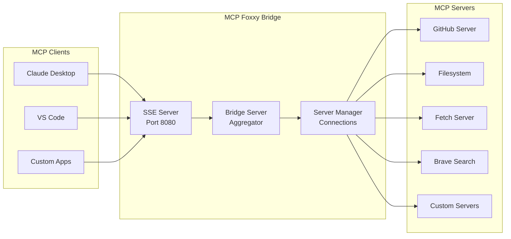
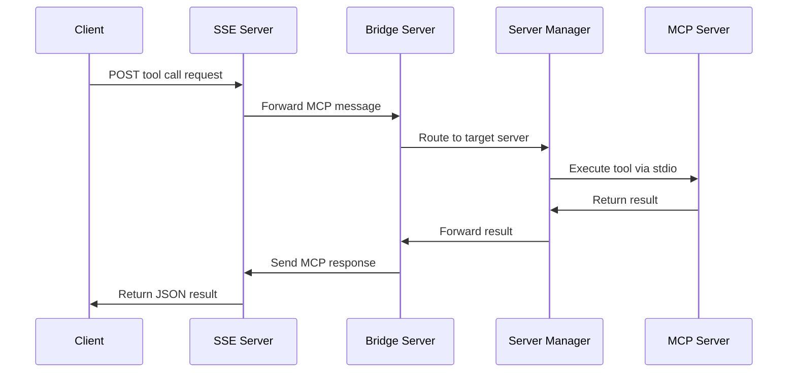

# Architecture Overview

This document provides a technical overview of MCP Foxxy Bridge's architecture,
design principles, and implementation details.

## System Architecture



## Core Components

### 1. SSE Server (`mcp_server.py`)

**Responsibility:** HTTP server providing SSE endpoints for MCP clients

**Key Features:**

- Starlette-based ASGI application
- Server-Sent Events (SSE) transport for MCP protocol
- StreamableHTTP support for advanced clients
- Auto port-finding with increment fallback
- Graceful shutdown handling

**Endpoints:**

- `GET /sse` - Main MCP client connection point
- `GET /status` - Health and status monitoring
- `POST /messages/` - MCP message handling

### 2. Bridge Server (`bridge_server.py`)

**Responsibility:** MCP protocol implementation and tool aggregation

**Key Features:**

- Implements MCP Server SDK interface
- Aggregates capabilities from multiple backend servers
- Handles tool/resource/prompt routing
- Manages namespacing and conflict resolution
- Provides unified client interface

**Core Methods:**

- `list_tools()` - Aggregate tools from all servers
- `call_tool()` - Route tool calls to appropriate server
- `list_resources()` - Aggregate resources with namespacing
- `read_resource()` - Route resource reads

### 3. Server Manager (`server_manager.py`)

**Responsibility:** Backend MCP server lifecycle and connection management

**Key Features:**

- Manages multiple stdio MCP server connections
- Health monitoring and automatic failover
- Connection retry logic with exponential backoff
- Graceful shutdown with context management
- Server capability discovery and caching

**Server States:**

- `CONNECTING` - Initial connection attempt
- `CONNECTED` - Active and healthy
- `FAILED` - Connection failed or server unhealthy
- `DISCONNECTED` - Cleanly disconnected
- `DISABLED` - Administratively disabled

### 4. Config Loader (`config_loader.py`)

**Responsibility:** Configuration parsing and validation

**Key Features:**

- JSON configuration file parsing
- Environment variable expansion (`${VAR_NAME}`)
- JSON Schema validation
- Server configuration normalization
- Bridge settings management

**Environment Variable Syntax:**

- `${VAR_NAME}` - Required variable
- `${VAR_NAME:default}` - Variable with default value
- Recursive expansion through nested structures

## Data Flow

### Tool Call Flow



### Capability Discovery Flow

```mermaid
flowchart TD
    A[Server Manager Start] --> B[Connect to All Configured Servers]
    B --> C{For Each Server}
    C --> D[Execute list_tools()]
    C --> E[Execute list_resources()]
    C --> F[Execute list_prompts()]
    D --> G[Apply Namespace Transformations]
    E --> G
    F --> G
    G --> H[Cache Capabilities Locally]
    H --> I{More Servers?}
    I -->|Yes| C
    I -->|No| J[Bridge Server: Aggregate All Capabilities]
    J --> K[Client Request: Return Unified Capability List]
```

## Design Principles

### 1. Transparency

The bridge acts as a transparent proxy, preserving MCP protocol semantics
while adding aggregation capabilities.

### 2. Fault Tolerance

- Individual server failures don't bring down the bridge
- Automatic retry and recovery mechanisms
- Health monitoring and failover support
- Graceful degradation when servers are unavailable

### 3. Scalability

- Asynchronous I/O throughout the stack
- Connection pooling and reuse
- Efficient tool routing with caching
- Configurable resource limits

### 4. Extensibility

- Plugin-like server configuration
- Support for any stdio-based MCP server
- Flexible namespacing and routing rules
- Environment-based configuration

## Namespacing Strategy

### Tool Namespacing

Tools are namespaced to prevent conflicts between servers:

```text
Original: search_repositories
Namespaced: github.search_repositories
```

**Resolution Order:**

1. Check explicit namespace configuration
2. Use server name as default namespace (if enabled)
3. Apply conflict resolution strategy

### Resource Namespacing

Resources use URI-style namespacing:

```text
Original: file.txt
Namespaced: fs://file.txt
```

### Conflict Resolution Strategies

1. **Namespace** (default): Add namespaces to prevent conflicts
2. **Priority**: Higher priority server wins
3. **First**: First server to register wins
4. **Error**: Throw error on conflicts

## Connection Management

### AsyncExitStack Pattern

The bridge uses Python's `AsyncExitStack` to manage the lifecycle of async
context managers:

```python
async with contextlib.AsyncExitStack() as stack:
    # Enter stdio_client context
    read_stream, write_stream = await stack.enter_async_context(stdio_client(params))
    
    # Enter ClientSession context  
    session = await stack.enter_async_context(ClientSession(read_stream, write_stream))
    
    # Both contexts remain active until stack exits
```

### Health Monitoring

Each server has continuous health monitoring:

```python
async def health_check_loop():
    while not shutdown:
        for server in active_servers:
            try:
                await server.session.list_tools()  # Simple ping
                server.mark_healthy()
            except Exception:
                server.mark_unhealthy()
        await asyncio.sleep(health_check_interval)
```

## Error Handling

### Error Propagation

Errors are propagated with context preservation:

1. **Server Errors**: Forwarded to client with server identification
2. **Connection Errors**: Trigger retry logic and failover
3. **Protocol Errors**: Wrapped in standard MCP error format
4. **Configuration Errors**: Fail fast at startup

### Retry Logic

Exponential backoff for connection failures:

```python
for attempt in range(max_retries):
    try:
        await connect_to_server()
        break
    except Exception:
        await asyncio.sleep(base_delay * (2 ** attempt))
```

## Security Model

### Isolation

- Each MCP server runs in its own process
- No direct inter-server communication
- Environment variable isolation per server

### Access Control

- No built-in authentication (design choice)
- Relies on network-level security
- Environment variable based secrets

### Process Management

- Child processes don't inherit parent signals
- Graceful shutdown with timeout enforcement
- Resource cleanup on exit

## Performance Characteristics

### Latency

- **Tool calls**: ~10-50ms overhead (mostly I/O)
- **Capability listing**: Cached, <1ms after warmup
- **Connection setup**: ~100-500ms per server

### Memory Usage

- **Base bridge**: ~20-30MB
- **Per server**: ~5-10MB overhead
- **Per connection**: ~1-2MB

### Concurrency

- Fully asynchronous I/O
- No global locks or bottlenecks
- Scales with available file descriptors

## Configuration Schema

### Server Configuration

```typescript
interface ServerConfig {
  // Connection
  enabled: boolean;
  command: string;
  args: string[];
  env: Record<string, string>;
  timeout: number;
  
  // Reliability
  retryAttempts: number;
  retryDelay: number;
  healthCheck: HealthCheckConfig;
  
  // Routing
  toolNamespace?: string;
  resourceNamespace?: string;
  promptNamespace?: string;
  priority: number;
  
  // Metadata
  tags: string[];
}
```

### Bridge Configuration

```typescript
interface BridgeConfig {
  conflictResolution: ConflictStrategy;
  defaultNamespace: boolean;
  aggregation: {
    tools: boolean;
    resources: boolean;
    prompts: boolean;
  };
  failover: {
    enabled: boolean;
    maxFailures: number;
    recoveryInterval: number;
  };
}
```

## Extension Points

### Custom Server Types

While currently stdio-only, the architecture supports extension:

```python
class CustomServerManager:
    async def connect(self, config: ServerConfig) -> ClientSession:
        # Custom connection logic
        pass
```

### Custom Routing

Tool routing can be extended with custom logic:

```python
class CustomBridgeServer:
    def route_tool_call(self, tool_name: str) -> ManagedServer:
        # Custom routing logic
        pass
```

### Middleware Support

The Starlette-based server supports standard ASGI middleware:

```python
middleware = [
    Middleware(AuthenticationMiddleware),
    Middleware(RateLimitingMiddleware),
    Middleware(LoggingMiddleware),
]
```

## Future Architecture Considerations

### Multi-Protocol Support

- WebSocket transport for low-latency clients
- gRPC support for high-performance scenarios
- HTTP/2 for multiplexed connections

### Distributed Deployment

- Multiple bridge instances with load balancing
- Shared state via Redis or similar
- Cross-bridge server discovery

### Advanced Routing

- Content-based routing (route by tool arguments)
- Load-based routing (route to least loaded server)
- Geographic routing (route to nearest server)

### Observability

- OpenTelemetry integration
- Structured logging with correlation IDs
- Prometheus metrics export
